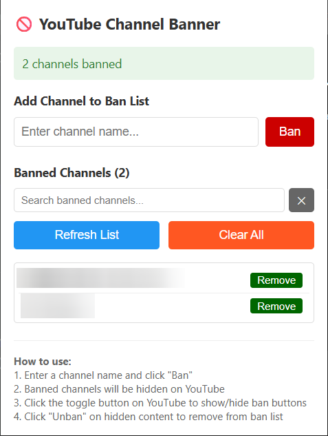
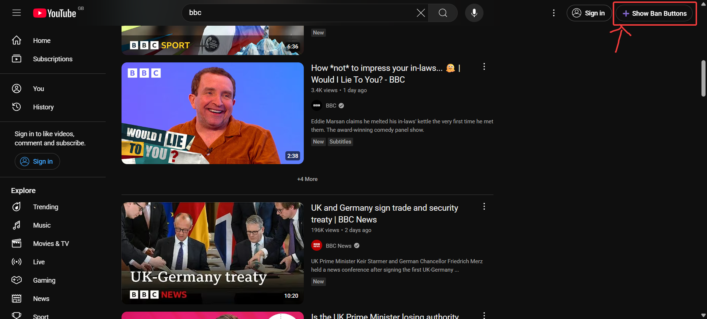
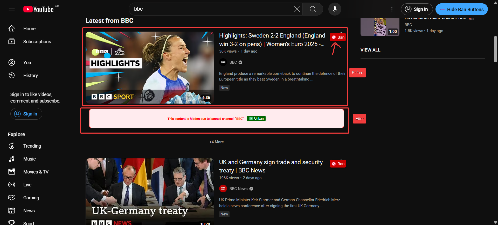

# YouTube Channel Banner

Project starts on 13-07-2025

&nbsp;&nbsp;&nbsp;

A Chrome extension that allows you to ban YouTube channels and hide their content from your feed.

Give me a ⭐ if you like it.

## 🗝️ Features

- **Hide Channel Content**: Banned channels' videos will be replaced with a message indicating they are hidden
- **Easy Management**: Add and remove channels from your ban list through the extension popup
- **Realtime Sync Across Sessions**: Ban list is shared between regular and incognito modes

## 🚀 Installation

1. Clone or download this repository
2. Open Chrome and navigate to `chrome://extensions/`
3. Enable "Developer mode" in the top right
4. Click "Load unpacked" and select the `chrome` folder
5. The extension will now be installed and ready to use

## 🛠️ Usage

### Managing Banned Channels

1. Click the extension icon in your Chrome toolbar
2. Enter a channel name in the input field
3. Click "Ban" to add it to your ban list
4. Use the "Remove" button next to any channel to unban it
5. Use "Clear All" to remove all banned channels at once
[]

### On YouTube Pages

1. Visit any YouTube page (home, search, etc.)
2. Click the "➕ Show Ban Buttons" toggle button (appears in the top right)
[]
3. Ban buttons will appear next to channel names
4. Click "🚫 Ban" to quickly ban a channel (Refresh to see the change)
5. Banned content will be replaced with a message and an "✅ Unban" button
[]

## 🔒 Privacy

This extension:

- ✅ Stores data locally on your device only
- ✅ Does not send any data to external servers
- ✅ Does not track your browsing behavior
- ✅ Only runs on YouTube pages

## 🔧 Development

To modify the extension:

1. Make changes to the source files
2. Reload the extension in `chrome://extensions/`
3. Test your changes on YouTube

## 🔒 Limitations

- We are using Chrome's `storage.sync` API which has a 100KB limit for the ban list. (This is sufficient for thousands of channel names)

## ⭐ TODO

- n/a

## 🐛 Known Issues

- n/a

## 🤝 Contributing

Contributions are welcome! If you find a bug or have a feature request, please open an issue. If you want to contribute code, please fork the repository and submit a pull request with your changes.

We are following [Conventional Commits](https://www.conventionalcommits.org/en/v1.0.0/) for commit messages.

## 📝 License

This project is licensed under the MIT License - see the [LICENSE](LICENSE) file for details

## ☕ Donation

Love it? Consider a donation to support my work.

 <- click me~
